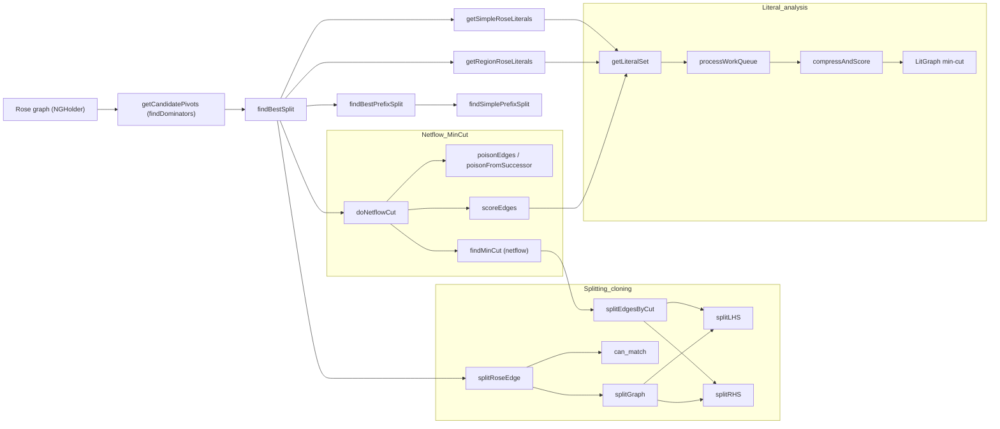

# Regex / NFA Decomposition

This diagram summarizes the main steps Hyperscan uses to decompose an NFA (NGHolder) into LHS/RHS pieces and to extract useful literals for Rose.

Legend: node labels show the function name; where useful the originating source (for example: ng_violet.cpp, ng_split.cpp, ng_literal_analysis.cpp, ng_netflow.cpp) maps to stages in the diagram.

Files referenced in this repo:
- src/nfagraph/ng_violet.cpp — orchestration, findBestSplit, splitRoseEdge, doNetflowCut.
- src/nfagraph/ng_split.cpp — low-level splitGraph, splitLHS, splitRHS.
- src/nfagraph/ng_literal_analysis.cpp — getLiteralSet, compressAndScore.
- src/nfagraph/ng_netflow.cpp — findMinCut (netflow).

Next: I can render this Mermaid diagram to SVG for preview, or embed it in the repo README; which do you prefer?
